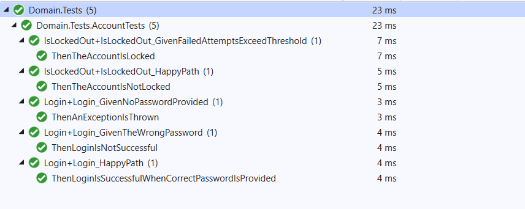

Title: A unit testing Example
Published: 2021-03-12
Tags:
    - .Net
    - Unit Testing
    - BDD
    - Opinionated
---

Whether you are in the TDD camp or not, It goes without saying that unit testing is a very powerful way to ensure that your code is supposed to do what it is supposed to do. I never really got into TDD because by the time I had started to learn about it, I had already started to learn other patterns and techniques to design a losely coupled application. Afterall, the biggest benefit of TDD seems to be design. Regardles of the approach, testing our code is just a core part of software development. 

When talking about testing, two of ways that come up are the arrange/act/asert and the behaviour driven design style. In arrange/act/assert, you arrange your test, act upon the system under test and the make assertions about the result. While BDD style tests are written in the gherkin language style, popularized by the [Cucumber framework](https://cucumber.io/docs/gherkin/). It provides a more contextual way of testing with the Given/When/Then style of unit tests. [Specflow](https://specflow.org) is a very popular framework within the .net world. I am in love with specflow. :). 

However, nothing is free. BDD style tests and Specflow in general can be a little bit of a high maintenance. Especially, if you are learning the tools as you go. Many developers will completely dismiss them stating requiring too much effort to write and maintain. While, I think some of it has to do with lack of knowledge and experience with the tool, I do think they require a little bit of extra work to be able to setup and continue using. 

Even when I cannot use a tool like Specflow, I have come to write a little simpler form of BDD tests which are a little better than just arrange/act/assert and more lightweight than full on Specflow and here I will show an example of that. 

# Domain

[TLDR; just show me the code](https://github.com/qudooschaudhry/UnitTestExample). **sample code, don't use in production :)**

I have picked a simple scenario for the example. Users in my application need to be able to login to it and use the application. If users login attempts continue to fail, I want to know if they are lockedout if they exceed the threshold within a given amount of time. Simple, yes? :)

*Note: Don't build  an authentication system if building authentication systems is not your core competency.*

My model is very simple with an `Account` domain object having two methods `Login` and `IsLockedOut`. If you have seen enough unit testing projects, you will have seen the test organized like the following:

```c

public class AccountTests
{
    [Test]
    public void can_login()
    {
        //arrange
        //act
        /assert
    }

    [Test] 
    public void can_determine_if_account_is_locked() 
    {
        //arrange
        //act
        /assert
    }
    .
    .
    .
}

```

This is fine, but as the Account model grows in functionality, this one class to have all the tests becomes quite hard to maintain. Some teams will use `regions` to separate the tests related to a certain method as well. It works, but it does not give a good enough visibility into what is being tested. 

# A Given/When/Then Style of Unit Test

I like to use a base class in my testing project called `SpecificationBase` and this is the code it has

```c
 public abstract class SpecificationBase
    {
        protected virtual void Given() { }
        protected virtual void When() { }
        
        public SpecificationBase()
        {
            Given();
            When();
        }
    }
```

And each test I write just inherits from this. Each Test can override the `Given` method to `arrange` whatever setup needs to be required for the given test. `When` is overridden to perform the `act` on the system under test. Then each Test can have one or mutliple Tests which start with `Then` and describe what should happen in this case. I also use a little  partial class and inheritance magic for the tests to display very nicely in a test explorer for instance they would show like this in visual studio



As you can see, instead of lumping all the unit tests of the Account model into one large unit test class, I treat each method within that model to be a testable unit and build the testing language around that. These can be within the same file or they can be separated out in which case they do display all together in solution explorer. 

I have found this method to be a happy medium between the typical arrange/act/assert and the full on BDD style of unit tests and has worked very well for me. It requires a little bit of extra work but the unit tests become very explicit and easy to manage. 

Happy coding and unit testing!

~Q 


