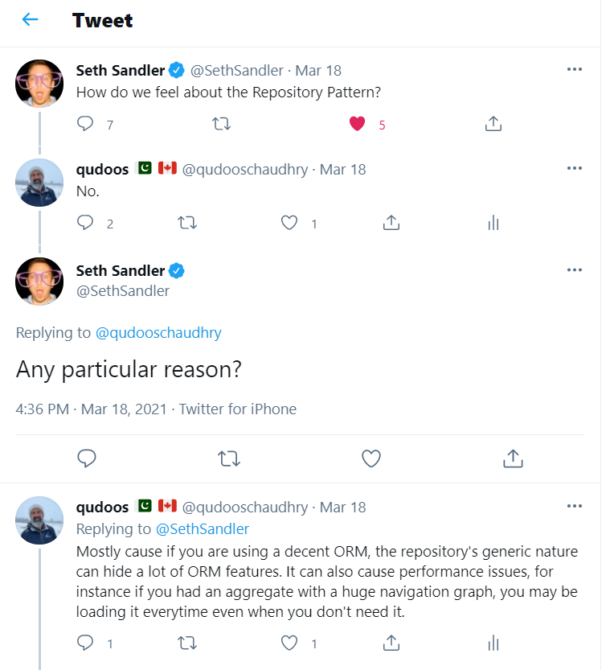

Title: Repository Pattern - Part 1
Published: 2021-03-24
Tags:
    - Patterns
    - DDD
    - ORM
    - Opinionated
---

Recently, I had this [conversation](https://twitter.com/qudooschaudhry/status/1372643561204748294) on twitter regarding The Respository Pattern. 



I know, my response is a little cheeky. A better answer would have been "it depends" ;)

I think there are times when it makes sense and there is a lot of material out there talking in favour of or against the repository pattern. I also wanted to document my thoughts in the form of a post. So, let's dive in.

## What is the Repository Pattern? 

As awlays, Martin Fowler has a good quick [explanation](https://martinfowler.com/eaaCatalog/repository.html) on the PEAA catalog. That first line 

*Mediates between the domain and data mapping layers using a collection-like interface for accessing domain objects.*

pretty much sums it up. As far as my knowledge is concerened, I think the pattern gained a popularity after the famous [DDD blue book](https://www.domainlanguage.com/ddd/). In his book, Evans describes the repository like so 

***For each type of object that needs global access, create an object that can provide the
illusion of an in-memory collection of all objects of that type. Set up access through a
well-known global interface. Provide methods to add and remove objects, which will
encapsulate the actual insertion or removal of data in the data store. Provide methods
that select objects based on some criteria and return fully instantiated objects or
collections of objects whose attribute values meet the criteria, thereby encapsulating
the actual storage and query technology. Provide REPOSITORIES only for AGGREGATE roots
that actually need direct access. Keep the client focused on the model, delegating all
object storage and access to the REPOSITORIES.***

This makes a lot of sense. Keep data access and storage capabilities away from the domain model, and let the domain model handle the business requirements. As someone who has been practicing DDD for quite sometime, I cannot agree more with this and the separation that it provides in our codebases. However, I think if we are using a decent ORM, building a repository on top of that comes with some problems and I want to highlight those here.  

## The Domain :)

I have picked a simple but realistic domain. Not your everyday blog or todo list. ;) 

Today we are working with e-learning system. Specifically, a learning management system that acts as a backoffice application to manage course content. The team has worked hard to understand some of the requirements and have identified some entities within the system namely;

1. Course
2. Chapter
3. Page
4. Section
5. SectionType

Our team is new to DDD. While we have tried hard to not think about the underlying database, we cannot help it that an RDBMS is going to be holding the state of our domain objects. Some of our relational thinking has naturally seeped into our design, for instance, a *Course* has *Chapters* which has *Pages*, which in turn can have multiple *Sections*. After days of discussions, we have come to the conclusion that Course is the *aggregate root* in this context. 

*Side note: some of this can be deemed as bikeshedding. DDD encourages continual learning of our domain and adjust as we discover new things. Nothing will be right the first day, but since we lock ourselves into underlying technologies because that is all we know or how we have always done things, we end up trying to make these decisions upfront, which in some cases are not trivial.*

## Requirements for version 1

Here are the highlevel requirements for version 1. 

1. As a course designer, I need to be able to see the list of all course. 
2. As a course designer, I need to be able to select a course and edit it's properties.


## Project Structure and running the project

The project is located at my [github](https://github.com/qudooschaudhry/RepositoryPattern/tree/part1) in the branch called part1. 

The project follows the popular (and notorious) clean architecture style. I chose it for familiarity and kept it the way most people implement it i.e. technology structured as opposed to feature structured. So the main projects are 

1. LMS.UI - asp.net mvc project (controllers and views)
2. LMS.Infrastructure 
3. LMS.Domain

I skipped an application layer because I am trying to focus only on the repository layer, so the repositories are injected into the controllers. 

The project is built on .net 5.0 and uses `docker-compose` to bring up a sql server instance. I have not had much luck with docker-compose so I usually do a `docker pull microsoft/mssql-server-windows-developer` first. 

Should be able to run the project via F5. Once the migration has run you should be able to use SSMS to connect to the SQL Server at localhost,51433. SA password is in docker compose file. There is a script in the scripts folder to populate with some course data. 

Browsing to /courses should give you a list of course and clicking on a course should bring you to an edit form.

The `Index` view on the `CoursesController` uses the repository to load all course 

```C
 public async Task<IActionResult> Index(CancellationToken cancellationToken)
{
    var courses = await _courseRepository.GetAll(cancellationToken);
            
    return View(courses.Select(c => new CourseItemModel() 
    { 
        Id = c.Id,
        Name = c.Name,
        Startdate = c.StartDate,
        EndDate = c.EndDate
    }));
}
```

The `CourseRepository` uses the EF data context to perform the required operations

```c
public async Task<IEnumerable<Course>> GetAll(CancellationToken cancellationToken)
{
    await Task.Delay(0, cancellationToken);
    return _context.Courses.ToList();
}
```

I have tried to keep the repository layer as simple as possible and not have any other noise code so it is easier to follow along. 

Download the code and debug through it, or read it on github. That's it for part 1. In subsequent parts, I will be adding more funcitonality to the LMS and show how the repository pattern will start to become a problem as the code continues to grow. 

Happy coding. 

~Q


