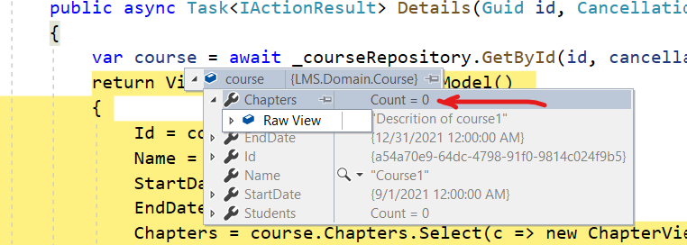

Title: Repository Pattern - Part 2
Published: 2021-03-28
Tags:
    - Patterns
    - DDD
    - ORM
    - Opinionated
---

In [part 1](https://qudooschaudhry.github.io/posts/repository-parttern-part1) of the post, I started building a small learning management system. I started off with a couple of requirements. The users like what the team has accomplished in this little while, but they have a few other requirements that they need to build for them to be able to work in the LMS effectively. Here are some of them that we will be building in this part. 

## Requirements for version 2

1. As a course designer, when I am on the Course page, I want to see a list of all the chapters in this course. 
2. As a course designer when I am on the chapter page, I would like to see a list of the pages on that chapter. 

I do not plan to build all these but these requirements will be suffficient to show, why in the long run the respository will start to hurt the project rather than help it. 

## Implementing Requirement 1 and uncovering a problem

*The source code for this is in the [part 2 branch](https://github.com/qudooschaudhry/RepositoryPattern/tree/part2).**

In part 1, I added an edit page, as I wanted to be able to quickly test if my repository was working. I will add a new view called `Details` and link the Edit page from there instead. I will update the link from the list page to goto the Course Details. This is where I will display a list of chapters on a given course. I have added a new ViewModel for this which looks something like this 

```C

public class CourseDetailsViewModel
{
    public Guid Id { get; set; }
    public string Name { get; set; }
    public string Description { get; set; }
    public DateTime StartDate { get; set; }
    public DateTime EndDate { get; set; }
    public List<ChapterViewModel> Chapters = new List<ChapterViewModel>();
}

public class ChapterViewModel 
{
    public int ChapterNumber { get; set; }
    public string Title { get; set; }
}
```

My Details controller action will be very similar to Edit, I just need to map the Chapter information from the retrieved course to the view model. 

```C
[HttpGet]
public async Task<IActionResult> Details(Guid id, CancellationToken cancellationToken)
{
    var course = await _courseRepository.GetById(id, cancellationToken);
    return View(new CourseDetailsViewModel() 
    {
        Id = course.Id,
        Name = course.Name,
        StartDate = course.StartDate,
        EndDate = course.EndDate,
        Chapters = course.Chapters.Select(c => new ChapterViewModel() 
        {
            Id = c.Id,
            ChapterNumber = c.Number,
            Title = c.Title,
        }).ToList()
    });
}

```


Odly enough, after making this change I was expecting some chapters to show up, since I know I seeded some chapters for each dummy course that I added. A quick debug revealed that there are no chapters



So, I went looking to the Course Repository and noticed that I was not including any chapters in the GetById call

```C
return _context.Courses.FirstOrDefault(c => c.Id == id);
```

So, I changed this to 

```C

return _context.Courses
                .Include(c => c.Chapters)
                .FirstOrDefault(c => c.Id == id);

```

...and that was it. As soon as I added this, my Course page displayed all the Chapters that are on this course. Which brings us to the first problem with the repository pattern. This seemingly innocent line `.Include(c => c.Chapters)` here has an impact everywhere. Whenever and whereever we call `await _courseRepository.GetById(id, cancellationToken)`, we are now also including the chapters, whether they are required or not. A lot of modern applications support inline editing as opposed to updating a whole form.  Each of those inline edit codes is now unnecessarily loading the chapters. This will continue to grow exponentially. As soon as I try to build requirement 2 , I will have to include pages as part of the Course Repository, after all it is the *aggregate root*. In large monolithic applications this becomes the source of quite some low performing queries, but since there are now so many parts of the applications depending on it, it becomes rather cumbersome and risky to change. This is where sometimes we end up seeing repositories with more and more methods, to support each special case. 

## Leaky Abstraction

Sometimes we hear the term that a repository is a leaky abstraction and what it means is that the underying capabilities of the ORM start to leak through the repository. For instance in case of the `.Include` example above, we could add another method to the Repository which could be like `GetCourseWithChapter` and suddenly now we are starting to build methods based on the ORM capabilities. To me it becomes a layer that serves no purpose now. 

## Hides ORM Capabilities

### AsNoTracking
The repository can hide very useful ORM capabilities and if we want to use them, we have to pretty much have to make it a leaky abstraction. One such example in case of Entity Framework is the `AsNoTracking` method. This method provides better performance because it tells entity framework to not track any changes in the EF. In case of *queries*, we do not need to track for changes so we should be using this handy method. However, our choice of using the repository pattern kind of makes it impossible for us to use, because when we do `GetById`, we don't know if we are going to just Query or whether we are going to Load and Save. Again, to use this, we would have to add another method on the Repository as `GetByIdWithoutTracking`, at which point it is just becoming silly. 

### Dynamic objects

ORM's like EF provide the capability to query just a handful of the fields. This can be handy if we have a table with too many columns, but in a specific case we are just want a few of them. We can use a Linq Select to return the fields we need as a dynamic object and the generated Queries will reflect that. This might even please our DBA's. 

### Replacing an ORM

One of the advantages that is listed for the repository pattern is that it allows to switch out an ORM easily. While this does not happen that often, it does happen. I have been a part of one or two such changes. On the surface this argument seems like it has some merit but I do not believe it plays out as simply as it is stated. Any changes to either the database or the ORM are a set of changes that need to be done carefully and methodically. If I just one day come and replace the base repository implementation to another implementation that works on the new ORM, I can guarantee that I will run into some issues. I'd rather start to introduce the new ORM slowly in some areas (*test on an inconspicuous area first*) of the application and then continue to change slowly. Changing the repository layer and impacting the whole application at once is just not a pragmatic approach to such a large change. Some might argue to create a new repository for the new ORM and slowly change the repositories, well then that violates the first argument. Just ditch the repository already.

### Unit Testing

Another argument for the repository pattern is testability. I find this somewhat dogmatic. Personally, I use mocking sparingly. I do use it, but only for some lightweight behavioural testing. I like to keep my unit tests rather easy to grasp for someone reading them. I find too much mocking makes that quite hard. Moreover, modern ORM's like EF has a nice in-memory package to run unit tests. If that does not work, integration tests provide a lot of value. 

## Conclusion

In conclusion, I would like to say that while the repository pattern is a good way to operate on your domain model in memory, a modern ORM has way more capabilities and provides this abstraction much better. Instead of thinking about every thing in terms of generic and reusability, there is a lot of value thinking in terms of explicitness. Code that is explicit, is easy to read, easy to debug and fix. Instead of using repositories, I like to write my code in terms of Queries and Commands, there is a lot of material out there but I do plan to create some easy examples to show that in the future.


Happy coding. 

~Q
